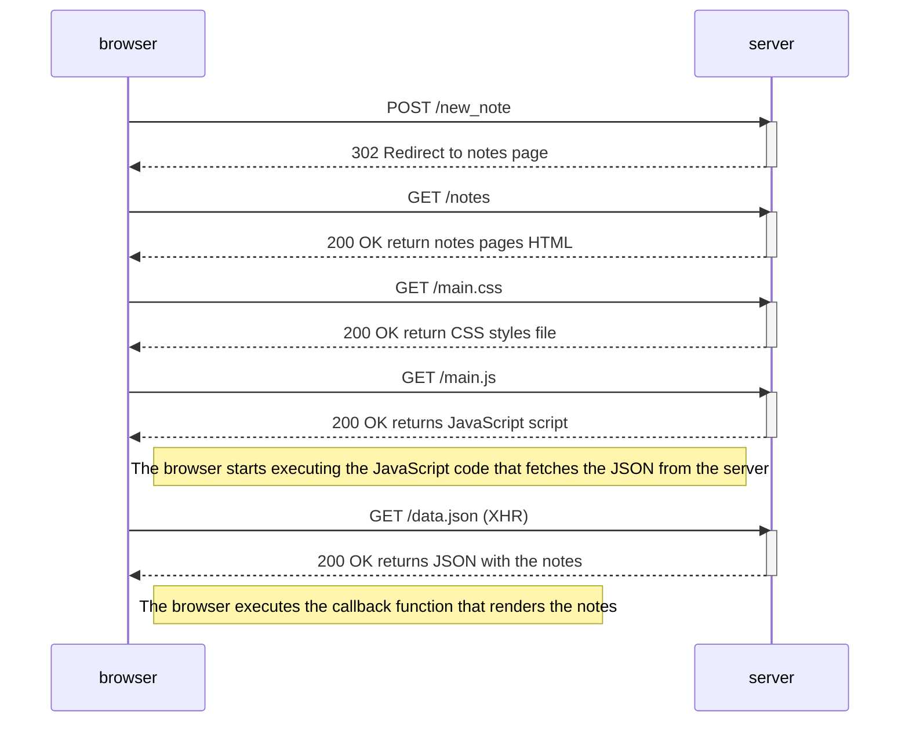

```mermaid

sequenceDiagram
    participant browser
    participant server

    browser->>server: POST /new_note
    activate server
    server-->>browser: 302 Redirect to notes page
    deactivate server

    browser->>server: GET /notes
    activate server
    server-->>browser: 200 OK return notes pages HTML
    deactivate server

    browser->>server: GET /main.css
    activate server
    server-->>browser: 200 OK return CSS styles file
    deactivate server

    browser->>server: GET /main.js
    activate server
    server-->>browser: 200 OK returns JavaScript script
    deactivate server

    Note right of browser: The browser starts executing the JavaScript code that fetches the JSON from the server

    browser->>server: GET /data.json (XHR)
    activate server
    server-->>browser: 200 OK returns JSON with the notes  
    deactivate server

    Note right of browser: The browser executes the callback function that renders the notes
```