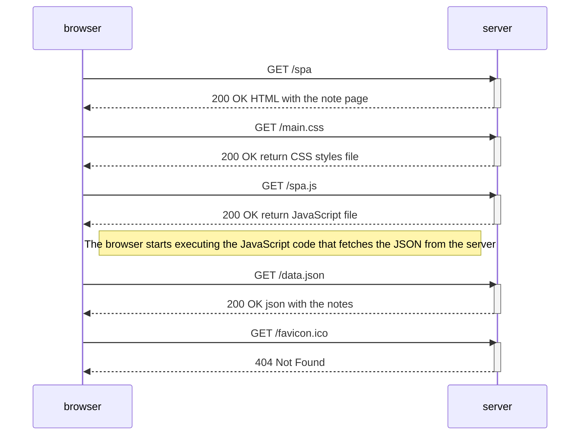

```mermaid

sequenceDiagram
    participant browser
    participant server

    browser->>server: GET /spa
    activate server
    server-->>browser: 200 OK HTML with the note page
    deactivate server
    
    
    browser->>server: GET /main.css
    activate server
    server-->>browser: 200 OK return CSS styles file
    deactivate server

    browser->>server: GET /spa.js
    activate server
    server-->>browser: 200 OK return JavaScript file
    deactivate server
    
    Note right of browser: The browser starts executing the JavaScript code that fetches the JSON from the server

    browser->>server: GET /data.json
    activate server
    server-->>browser: 200 OK json with the notes
    deactivate server
    
    browser->>server: GET /favicon.ico
    activate server
    server-->>browser: 404 Not Found
    deactivate server
```